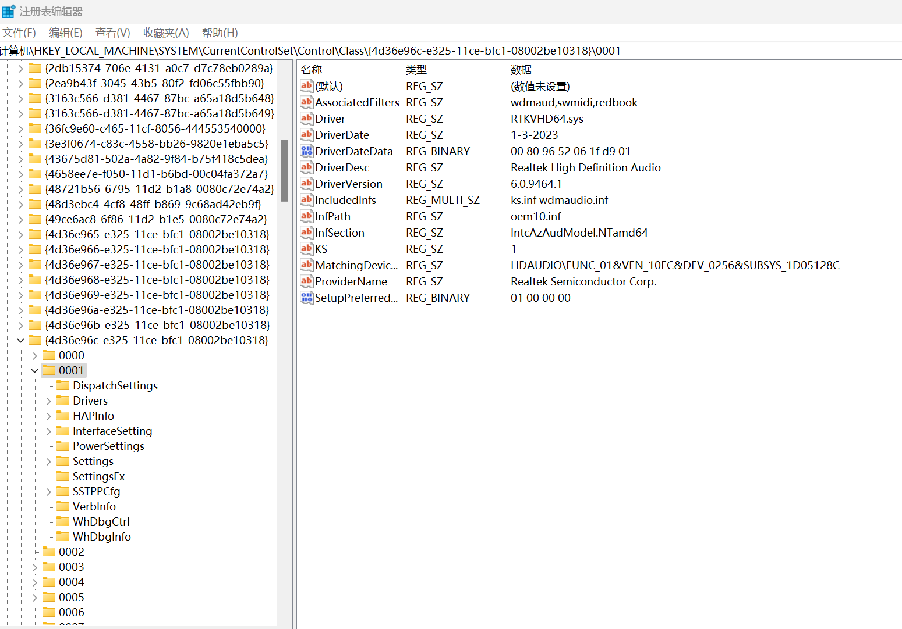
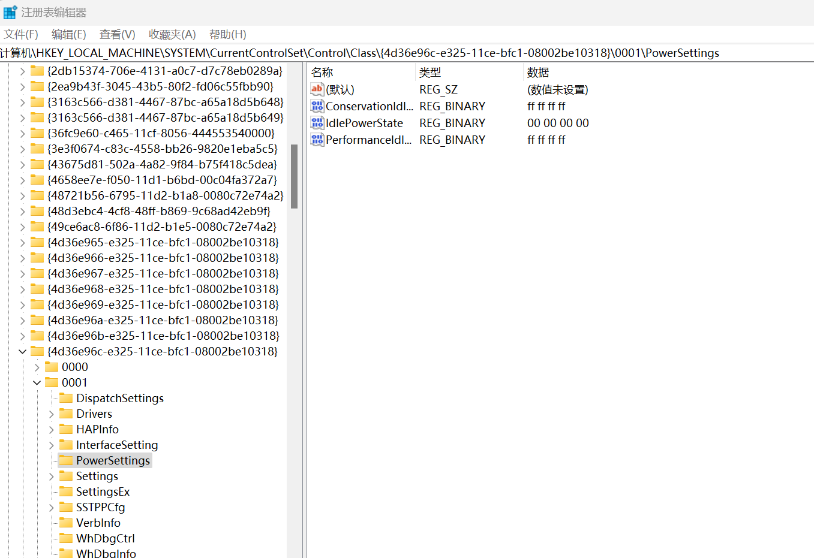

# 如何解决蛟龙16k有线耳机爆音噼啪响

## 环境与问题

机型蛟龙16k 4060版本，在播放声音前，响一声，播放结束后几秒，又响一声。

## 原因

瑞昱声卡驱动电源管理会让声卡在没声音的时候休眠，声卡进入和离开休眠状态会让耳机噼啪响。

## 解决方案

修改注册表，禁用瑞昱的驱动休眠。

打开注册表编辑器，到注册表的 HKEY_LOCAL_MACHINE\SYSTEM\CurrentControlSet\Control\Class\{4d36e96c-e325-11ce-bfc1-08002be10318} 位置，里面会有很多0000、0001、0002这样的项，每个都是一个声音设备。
我们需要找到瑞昱声卡，特征是"DriverDesc"是"Realtek High Definition Audio"，"Driver"是"RTKVHD64.sys"。

在瑞昱声卡对应的项里，点开PowerSettings，把里面的"ConservationIdleTime"，"PerformanceIdleTime"都改成ff ff ff ff，"IdlePowerState“改成00 00 00 00。

可能有多个目录里都是Realtek High Definition Audio，均进行修改。改完保存，重启电脑，故障消失。

对于其他机型类似问题，也可以用这个方法解决。
