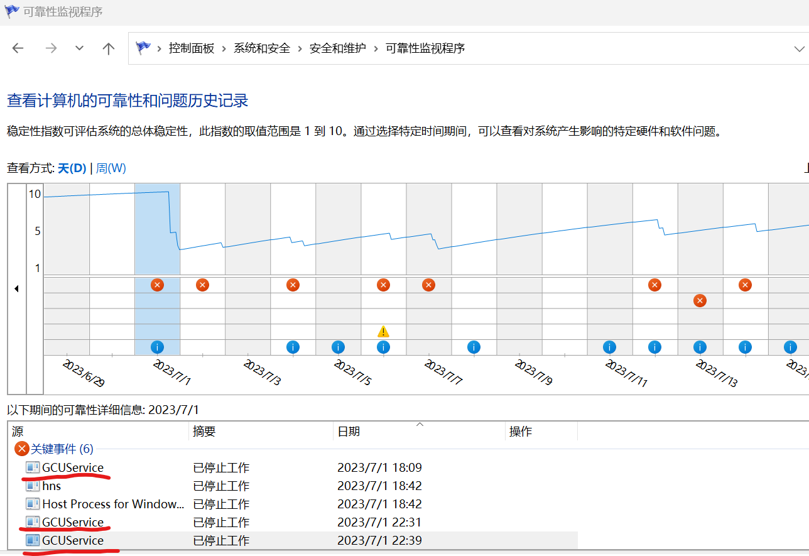
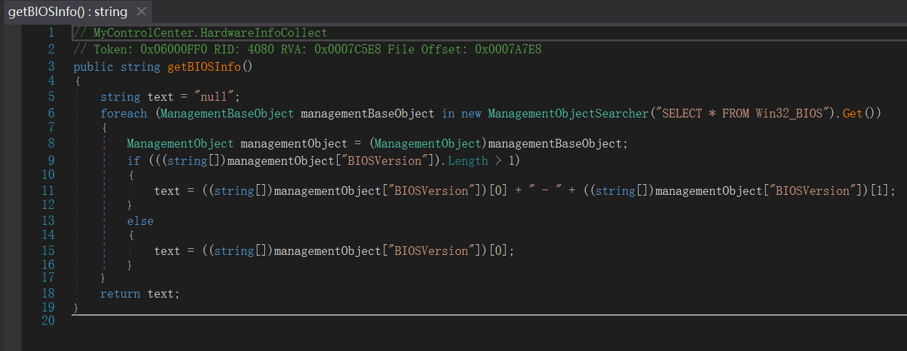
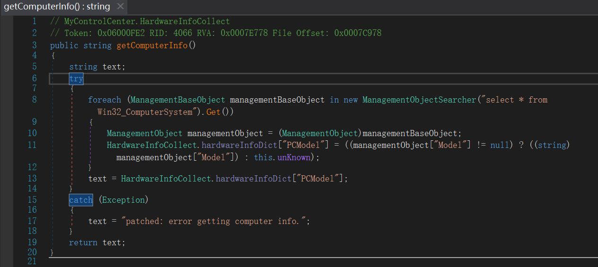

# 机械革命40系电竞控制台GCUService频繁崩溃问题分析和解决

## 环境与问题
机型蛟龙16k 4060版本，电竞控制台为官网在2023/04/21发布的5.17.49.6版本，系统Windows 11。

症状为在“控制面板>系统和安全>安全和维护>维护>查看可靠性历史记录”中出现大量GCUService已停止工作的记录，如下图所示。

## 问题分析

GCUService是一个.NET程序，且没有混淆和加密，因此可以使用dnSpy对GCUService进行反编译，获取几乎无损的程序源码。

结合系统日志查看器中记录的程序崩溃日志中对System.Management.dll中方法的调用，在控制台源码中定位到
GCUService/MyControlCenter/CustomizeCtrl.cs，GCUService/MyControlCenter/HardwareInfoCollect.cs，GCUService/MyECIO/AcpiCtrl.cs三个文件。这三个文件中存在用foreach对ManagementObjectSearcher进行循环的代码，而此处这些代码里大部分都没有做异常处理，导致在System.Management.dll里抛出的异常导致程序异常退出。

因此解决方案非常简单粗暴，给这些foreach都套上一个try catch程序就不会崩溃了，因此我们直接用dnspy修改程序源码然后重新编译即可。这里给出其中一处的修改。

## 修复操作方法

下面直接给出修改后的GCUService程序，点击[此处](https://wwi.lanzoup.com/ibggH13gbfna)下载，将原有的GCUService替换即可解决问题。

第一步：打开路径`C:\Program Files\OEM\机械革命电竞控制台\UniwillService\MyControlCenter`，找到GCUService.exe，改名为GCUService.exe.bak作为备份。

第二步：下载链接里的GCUService.exe，复制到上面的路径里面。

第三步：重启电脑。

## 注意事项
此处提供的文件针对的是40系的电竞控制台，版本为5.17.49.6版本，其中GCUService的版本是1.0.2.70，请确认是40系的电脑，完全一样的控制台版本再替换，否则可能会出现问题。

此外这个问题目前来看对电脑运行影响不大，如果没有强迫症其实可以不用管。
